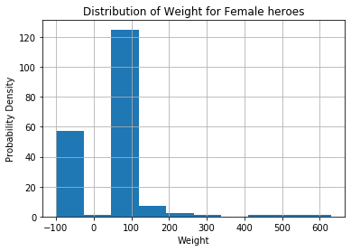

```python
import pandas as pd
import numpy as np
import seaborn as sns
import matplotlib.pyplot as plt
%matplotlib inline
```


```python
heroes_df = pd.read_csv('heroes_information.csv')
powers_df = pd.read_csv('super_hero_powers.csv')

display(heroes_df.head())
powers_df.head()
```


<div>
<style scoped>
    .dataframe tbody tr th:only-of-type {
        vertical-align: middle;
    }

    .dataframe tbody tr th {
        vertical-align: top;
    }

    .dataframe thead th {
        text-align: right;
    }
</style>
<table border="1" class="dataframe">
  <thead>
    <tr style="text-align: right;">
      <th></th>
      <th>Unnamed: 0</th>
      <th>name</th>
      <th>Gender</th>
      <th>Eye color</th>
      <th>Race</th>
      <th>Hair color</th>
      <th>Height</th>
      <th>Publisher</th>
      <th>Skin color</th>
      <th>Alignment</th>
      <th>Weight</th>
    </tr>
  </thead>
  <tbody>
    <tr>
      <td>0</td>
      <td>0</td>
      <td>A-Bomb</td>
      <td>Male</td>
      <td>yellow</td>
      <td>Human</td>
      <td>No Hair</td>
      <td>203.0</td>
      <td>Marvel Comics</td>
      <td>-</td>
      <td>good</td>
      <td>441.0</td>
    </tr>
    <tr>
      <td>1</td>
      <td>1</td>
      <td>Abe Sapien</td>
      <td>Male</td>
      <td>blue</td>
      <td>Icthyo Sapien</td>
      <td>No Hair</td>
      <td>191.0</td>
      <td>Dark Horse Comics</td>
      <td>blue</td>
      <td>good</td>
      <td>65.0</td>
    </tr>
    <tr>
      <td>2</td>
      <td>2</td>
      <td>Abin Sur</td>
      <td>Male</td>
      <td>blue</td>
      <td>Ungaran</td>
      <td>No Hair</td>
      <td>185.0</td>
      <td>DC Comics</td>
      <td>red</td>
      <td>good</td>
      <td>90.0</td>
    </tr>
    <tr>
      <td>3</td>
      <td>3</td>
      <td>Abomination</td>
      <td>Male</td>
      <td>green</td>
      <td>Human / Radiation</td>
      <td>No Hair</td>
      <td>203.0</td>
      <td>Marvel Comics</td>
      <td>-</td>
      <td>bad</td>
      <td>441.0</td>
    </tr>
    <tr>
      <td>4</td>
      <td>4</td>
      <td>Abraxas</td>
      <td>Male</td>
      <td>blue</td>
      <td>Cosmic Entity</td>
      <td>Black</td>
      <td>-99.0</td>
      <td>Marvel Comics</td>
      <td>-</td>
      <td>bad</td>
      <td>-99.0</td>
    </tr>
  </tbody>
</table>
</div>


<div>
<style scoped>
    .dataframe tbody tr th:only-of-type {
        vertical-align: middle;
    }

    .dataframe tbody tr th {
        vertical-align: top;
    }

    .dataframe thead th {
        text-align: right;
    }
</style>
<table border="1" class="dataframe">
  <thead>
    <tr style="text-align: right;">
      <th></th>
      <th>hero_names</th>
      <th>Agility</th>
      <th>Accelerated Healing</th>
      <th>Lantern Power Ring</th>
      <th>Dimensional Awareness</th>
      <th>Cold Resistance</th>
      <th>Durability</th>
      <th>Stealth</th>
      <th>Energy Absorption</th>
      <th>Flight</th>
      <th>...</th>
      <th>Web Creation</th>
      <th>Reality Warping</th>
      <th>Odin Force</th>
      <th>Symbiote Costume</th>
      <th>Speed Force</th>
      <th>Phoenix Force</th>
      <th>Molecular Dissipation</th>
      <th>Vision - Cryo</th>
      <th>Omnipresent</th>
      <th>Omniscient</th>
    </tr>
  </thead>
  <tbody>
    <tr>
      <td>0</td>
      <td>3-D Man</td>
      <td>True</td>
      <td>False</td>
      <td>False</td>
      <td>False</td>
      <td>False</td>
      <td>False</td>
      <td>False</td>
      <td>False</td>
      <td>False</td>
      <td>...</td>
      <td>False</td>
      <td>False</td>
      <td>False</td>
      <td>False</td>
      <td>False</td>
      <td>False</td>
      <td>False</td>
      <td>False</td>
      <td>False</td>
      <td>False</td>
    </tr>
    <tr>
      <td>1</td>
      <td>A-Bomb</td>
      <td>False</td>
      <td>True</td>
      <td>False</td>
      <td>False</td>
      <td>False</td>
      <td>True</td>
      <td>False</td>
      <td>False</td>
      <td>False</td>
      <td>...</td>
      <td>False</td>
      <td>False</td>
      <td>False</td>
      <td>False</td>
      <td>False</td>
      <td>False</td>
      <td>False</td>
      <td>False</td>
      <td>False</td>
      <td>False</td>
    </tr>
    <tr>
      <td>2</td>
      <td>Abe Sapien</td>
      <td>True</td>
      <td>True</td>
      <td>False</td>
      <td>False</td>
      <td>True</td>
      <td>True</td>
      <td>False</td>
      <td>False</td>
      <td>False</td>
      <td>...</td>
      <td>False</td>
      <td>False</td>
      <td>False</td>
      <td>False</td>
      <td>False</td>
      <td>False</td>
      <td>False</td>
      <td>False</td>
      <td>False</td>
      <td>False</td>
    </tr>
    <tr>
      <td>3</td>
      <td>Abin Sur</td>
      <td>False</td>
      <td>False</td>
      <td>True</td>
      <td>False</td>
      <td>False</td>
      <td>False</td>
      <td>False</td>
      <td>False</td>
      <td>False</td>
      <td>...</td>
      <td>False</td>
      <td>False</td>
      <td>False</td>
      <td>False</td>
      <td>False</td>
      <td>False</td>
      <td>False</td>
      <td>False</td>
      <td>False</td>
      <td>False</td>
    </tr>
    <tr>
      <td>4</td>
      <td>Abomination</td>
      <td>False</td>
      <td>True</td>
      <td>False</td>
      <td>False</td>
      <td>False</td>
      <td>False</td>
      <td>False</td>
      <td>False</td>
      <td>False</td>
      <td>...</td>
      <td>False</td>
      <td>False</td>
      <td>False</td>
      <td>False</td>
      <td>False</td>
      <td>False</td>
      <td>False</td>
      <td>False</td>
      <td>False</td>
      <td>False</td>
    </tr>
  </tbody>
</table>
<p>5 rows × 168 columns</p>
</div>


```python
heroes_df.drop('Unnamed: 0', axis=1, inplace=True)
heroes_df.head()
```


<div>
<style scoped>
    .dataframe tbody tr th:only-of-type {
        vertical-align: middle;
    }

    .dataframe tbody tr th {
        vertical-align: top;
    }

    .dataframe thead th {
        text-align: right;
    }
</style>
<table border="1" class="dataframe">
  <thead>
    <tr style="text-align: right;">
      <th></th>
      <th>name</th>
      <th>Gender</th>
      <th>Eye color</th>
      <th>Race</th>
      <th>Hair color</th>
      <th>Height</th>
      <th>Publisher</th>
      <th>Skin color</th>
      <th>Alignment</th>
      <th>Weight</th>
    </tr>
  </thead>
  <tbody>
    <tr>
      <td>0</td>
      <td>A-Bomb</td>
      <td>Male</td>
      <td>yellow</td>
      <td>Human</td>
      <td>No Hair</td>
      <td>203.0</td>
      <td>Marvel Comics</td>
      <td>-</td>
      <td>good</td>
      <td>441.0</td>
    </tr>
    <tr>
      <td>1</td>
      <td>Abe Sapien</td>
      <td>Male</td>
      <td>blue</td>
      <td>Icthyo Sapien</td>
      <td>No Hair</td>
      <td>191.0</td>
      <td>Dark Horse Comics</td>
      <td>blue</td>
      <td>good</td>
      <td>65.0</td>
    </tr>
    <tr>
      <td>2</td>
      <td>Abin Sur</td>
      <td>Male</td>
      <td>blue</td>
      <td>Ungaran</td>
      <td>No Hair</td>
      <td>185.0</td>
      <td>DC Comics</td>
      <td>red</td>
      <td>good</td>
      <td>90.0</td>
    </tr>
    <tr>
      <td>3</td>
      <td>Abomination</td>
      <td>Male</td>
      <td>green</td>
      <td>Human / Radiation</td>
      <td>No Hair</td>
      <td>203.0</td>
      <td>Marvel Comics</td>
      <td>-</td>
      <td>bad</td>
      <td>441.0</td>
    </tr>
    <tr>
      <td>4</td>
      <td>Abraxas</td>
      <td>Male</td>
      <td>blue</td>
      <td>Cosmic Entity</td>
      <td>Black</td>
      <td>-99.0</td>
      <td>Marvel Comics</td>
      <td>-</td>
      <td>bad</td>
      <td>-99.0</td>
    </tr>
  </tbody>
</table>
</div>


```python
display(heroes_df.describe())
powers_df.describe()
```


<div>
<style scoped>
    .dataframe tbody tr th:only-of-type {
        vertical-align: middle;
    }

    .dataframe tbody tr th {
        vertical-align: top;
    }

    .dataframe thead th {
        text-align: right;
    }
</style>
<table border="1" class="dataframe">
  <thead>
    <tr style="text-align: right;">
      <th></th>
      <th>Height</th>
      <th>Weight</th>
    </tr>
  </thead>
  <tbody>
    <tr>
      <td>count</td>
      <td>734.000000</td>
      <td>732.000000</td>
    </tr>
    <tr>
      <td>mean</td>
      <td>102.254087</td>
      <td>43.855191</td>
    </tr>
    <tr>
      <td>std</td>
      <td>139.624543</td>
      <td>130.823733</td>
    </tr>
    <tr>
      <td>min</td>
      <td>-99.000000</td>
      <td>-99.000000</td>
    </tr>
    <tr>
      <td>25%</td>
      <td>-99.000000</td>
      <td>-99.000000</td>
    </tr>
    <tr>
      <td>50%</td>
      <td>175.000000</td>
      <td>62.000000</td>
    </tr>
    <tr>
      <td>75%</td>
      <td>185.000000</td>
      <td>90.000000</td>
    </tr>
    <tr>
      <td>max</td>
      <td>975.000000</td>
      <td>900.000000</td>
    </tr>
  </tbody>
</table>
</div>


<div>
<style scoped>
    .dataframe tbody tr th:only-of-type {
        vertical-align: middle;
    }

    .dataframe tbody tr th {
        vertical-align: top;
    }

    .dataframe thead th {
        text-align: right;
    }
</style>
<table border="1" class="dataframe">
  <thead>
    <tr style="text-align: right;">
      <th></th>
      <th>hero_names</th>
      <th>Agility</th>
      <th>Accelerated Healing</th>
      <th>Lantern Power Ring</th>
      <th>Dimensional Awareness</th>
      <th>Cold Resistance</th>
      <th>Durability</th>
      <th>Stealth</th>
      <th>Energy Absorption</th>
      <th>Flight</th>
      <th>...</th>
      <th>Web Creation</th>
      <th>Reality Warping</th>
      <th>Odin Force</th>
      <th>Symbiote Costume</th>
      <th>Speed Force</th>
      <th>Phoenix Force</th>
      <th>Molecular Dissipation</th>
      <th>Vision - Cryo</th>
      <th>Omnipresent</th>
      <th>Omniscient</th>
    </tr>
  </thead>
  <tbody>
    <tr>
      <td>count</td>
      <td>667</td>
      <td>667</td>
      <td>667</td>
      <td>667</td>
      <td>667</td>
      <td>667</td>
      <td>667</td>
      <td>667</td>
      <td>667</td>
      <td>667</td>
      <td>...</td>
      <td>667</td>
      <td>667</td>
      <td>667</td>
      <td>667</td>
      <td>667</td>
      <td>667</td>
      <td>667</td>
      <td>667</td>
      <td>667</td>
      <td>667</td>
    </tr>
    <tr>
      <td>unique</td>
      <td>667</td>
      <td>2</td>
      <td>2</td>
      <td>2</td>
      <td>2</td>
      <td>2</td>
      <td>2</td>
      <td>2</td>
      <td>2</td>
      <td>2</td>
      <td>...</td>
      <td>2</td>
      <td>2</td>
      <td>2</td>
      <td>2</td>
      <td>2</td>
      <td>2</td>
      <td>2</td>
      <td>2</td>
      <td>2</td>
      <td>2</td>
    </tr>
    <tr>
      <td>top</td>
      <td>Cannonball</td>
      <td>False</td>
      <td>False</td>
      <td>False</td>
      <td>False</td>
      <td>False</td>
      <td>False</td>
      <td>False</td>
      <td>False</td>
      <td>False</td>
      <td>...</td>
      <td>False</td>
      <td>False</td>
      <td>False</td>
      <td>False</td>
      <td>False</td>
      <td>False</td>
      <td>False</td>
      <td>False</td>
      <td>False</td>
      <td>False</td>
    </tr>
    <tr>
      <td>freq</td>
      <td>1</td>
      <td>425</td>
      <td>489</td>
      <td>656</td>
      <td>642</td>
      <td>620</td>
      <td>410</td>
      <td>541</td>
      <td>590</td>
      <td>455</td>
      <td>...</td>
      <td>653</td>
      <td>651</td>
      <td>665</td>
      <td>658</td>
      <td>666</td>
      <td>666</td>
      <td>666</td>
      <td>665</td>
      <td>665</td>
      <td>665</td>
    </tr>
  </tbody>
</table>
<p>4 rows × 168 columns</p>
</div>


```python
heroes_df.isna().any()
```


    name          False
    Gender        False
    Eye color     False
    Race          False
    Hair color    False
    Height        False
    Publisher      True
    Skin color    False
    Alignment     False
    Weight         True
    dtype: bool


```python
heroes_df.isna().sum()
```


    name           0
    Gender         0
    Eye color      0
    Race           0
    Hair color     0
    Height         0
    Publisher     15
    Skin color     0
    Alignment      0
    Weight         2
    dtype: int64


```python
mean_weight = heroes_df['Weight'].mean()
heroes_df['Weight'].fillna(mean_weight, inplace=True)
heroes_df.isna().sum()
```


    name           0
    Gender         0
    Eye color      0
    Race           0
    Hair color     0
    Height         0
    Publisher     15
    Skin color     0
    Alignment      0
    Weight         0
    dtype: int64


```python
powers_df.isna().any()
```


    hero_names               False
    Agility                  False
    Accelerated Healing      False
    Lantern Power Ring       False
    Dimensional Awareness    False
                             ...  
    Phoenix Force            False
    Molecular Dissipation    False
    Vision - Cryo            False
    Omnipresent              False
    Omniscient               False
    Length: 168, dtype: bool


```python
powers_df.isna().any().any()
```


    False


```python
heroes_df.drop_duplicates(subset='name', inplace=True)
heroes_df.reset_index(drop=True, inplace=True)
```


```python
powers_df.rename(columns={'hero_names':'name'}, inplace=True)
```


```python
powers_df = powers_df.astype('str')
```


```python
heroes_and_powers_df = powers_df.set_index('name').join(heroes_df.set_index('name'), how='inner')
heroes_and_powers_df.head()
```


<div>
<style scoped>
    .dataframe tbody tr th:only-of-type {
        vertical-align: middle;
    }

    .dataframe tbody tr th {
        vertical-align: top;
    }

    .dataframe thead th {
        text-align: right;
    }
</style>
<table border="1" class="dataframe">
  <thead>
    <tr style="text-align: right;">
      <th></th>
      <th>Agility</th>
      <th>Accelerated Healing</th>
      <th>Lantern Power Ring</th>
      <th>Dimensional Awareness</th>
      <th>Cold Resistance</th>
      <th>Durability</th>
      <th>Stealth</th>
      <th>Energy Absorption</th>
      <th>Flight</th>
      <th>Danger Sense</th>
      <th>...</th>
      <th>Omniscient</th>
      <th>Gender</th>
      <th>Eye color</th>
      <th>Race</th>
      <th>Hair color</th>
      <th>Height</th>
      <th>Publisher</th>
      <th>Skin color</th>
      <th>Alignment</th>
      <th>Weight</th>
    </tr>
    <tr>
      <th>name</th>
      <th></th>
      <th></th>
      <th></th>
      <th></th>
      <th></th>
      <th></th>
      <th></th>
      <th></th>
      <th></th>
      <th></th>
      <th></th>
      <th></th>
      <th></th>
      <th></th>
      <th></th>
      <th></th>
      <th></th>
      <th></th>
      <th></th>
      <th></th>
      <th></th>
    </tr>
  </thead>
  <tbody>
    <tr>
      <td>A-Bomb</td>
      <td>False</td>
      <td>True</td>
      <td>False</td>
      <td>False</td>
      <td>False</td>
      <td>True</td>
      <td>False</td>
      <td>False</td>
      <td>False</td>
      <td>False</td>
      <td>...</td>
      <td>False</td>
      <td>Male</td>
      <td>yellow</td>
      <td>Human</td>
      <td>No Hair</td>
      <td>203.0</td>
      <td>Marvel Comics</td>
      <td>-</td>
      <td>good</td>
      <td>441.0</td>
    </tr>
    <tr>
      <td>Abe Sapien</td>
      <td>True</td>
      <td>True</td>
      <td>False</td>
      <td>False</td>
      <td>True</td>
      <td>True</td>
      <td>False</td>
      <td>False</td>
      <td>False</td>
      <td>False</td>
      <td>...</td>
      <td>False</td>
      <td>Male</td>
      <td>blue</td>
      <td>Icthyo Sapien</td>
      <td>No Hair</td>
      <td>191.0</td>
      <td>Dark Horse Comics</td>
      <td>blue</td>
      <td>good</td>
      <td>65.0</td>
    </tr>
    <tr>
      <td>Abin Sur</td>
      <td>False</td>
      <td>False</td>
      <td>True</td>
      <td>False</td>
      <td>False</td>
      <td>False</td>
      <td>False</td>
      <td>False</td>
      <td>False</td>
      <td>False</td>
      <td>...</td>
      <td>False</td>
      <td>Male</td>
      <td>blue</td>
      <td>Ungaran</td>
      <td>No Hair</td>
      <td>185.0</td>
      <td>DC Comics</td>
      <td>red</td>
      <td>good</td>
      <td>90.0</td>
    </tr>
    <tr>
      <td>Abomination</td>
      <td>False</td>
      <td>True</td>
      <td>False</td>
      <td>False</td>
      <td>False</td>
      <td>False</td>
      <td>False</td>
      <td>False</td>
      <td>False</td>
      <td>False</td>
      <td>...</td>
      <td>False</td>
      <td>Male</td>
      <td>green</td>
      <td>Human / Radiation</td>
      <td>No Hair</td>
      <td>203.0</td>
      <td>Marvel Comics</td>
      <td>-</td>
      <td>bad</td>
      <td>441.0</td>
    </tr>
    <tr>
      <td>Abraxas</td>
      <td>False</td>
      <td>False</td>
      <td>False</td>
      <td>True</td>
      <td>False</td>
      <td>False</td>
      <td>False</td>
      <td>False</td>
      <td>True</td>
      <td>False</td>
      <td>...</td>
      <td>False</td>
      <td>Male</td>
      <td>blue</td>
      <td>Cosmic Entity</td>
      <td>Black</td>
      <td>-99.0</td>
      <td>Marvel Comics</td>
      <td>-</td>
      <td>bad</td>
      <td>-99.0</td>
    </tr>
  </tbody>
</table>
<p>5 rows × 176 columns</p>
</div>


```python
male_heroes_df = heroes_df[heroes_df['Gender'] == 'Male']
female_heroes_df = heroes_df[heroes_df['Gender'] == 'Female']

ax = male_heroes_df.plot.scatter(x='Height', y='Weight', c='k', label='Male')
female_heroes_df.plot.scatter(x='Height', y='Weight', c='c', label='Female', ax=ax)
```


    <matplotlib.axes._subplots.AxesSubplot at 0x7fd13cbcbf90>


```python
def show_distplot(df, gender, column_name):
    plt.plot()
    df[column_name].hist()
    plt.title('Distribution of {} for {} heroes'.format(column_name, gender))
    plt.xlabel(column_name)
    plt.ylabel('Probability Density')
    plt.show()
```


```python
show_distplot(male_heroes_df, 'Male', 'Height')
print('Mean height for male heroes: {}'.format(male_heroes_df.Height.mean()))
print('Median height for male heroes: {}'.format(male_heroes_df.Height.median()))
```


    Mean height for male heroes: 109.11201629327903
    Median height for male heroes: 180.0


```python
show_distplot(male_heroes_df, 'Male', 'Weight')
print('Mean weight for male heroes: {}'.format(male_heroes_df.Weight.mean()))
print('Median weight for male heroes: {}'.format(male_heroes_df.Weight.median()))
```


    Mean weight for male heroes: 53.519053342681936
    Median weight for male heroes: 79.0


```python
show_distplot(female_heroes_df, 'Female', 'Height')
print('Mean height for female heroes: {}'.format(female_heroes_df.Height.mean()))
print('Median height for female heroes: {}'.format(female_heroes_df.Height.median()))
```


    Mean height for female heroes: 97.99234693877551
    Median height for female heroes: 168.0


```python
# Female Weight
show_distplot(female_heroes_df, 'Female', 'Weight')
print('Mean weight for female heroes: {}'.format(female_heroes_df.Weight.mean()))
print('Median weight for female heroes: {}'.format(male_heroes_df.Weight.median()))
```





    Mean weight for female heroes: 27.433673469387756
    Median weight for female heroes: 79.0


```python

```
